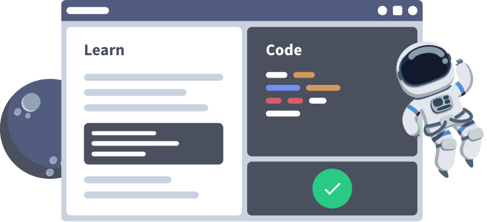
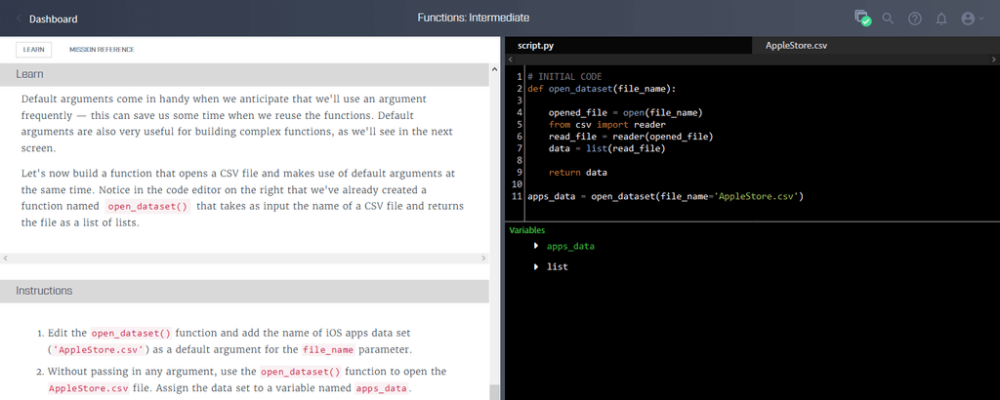

 

  

 

  <a href="https://www.dataquest.io/">Dataquest</a> is an online data learning portal that provides thousands of material and quizzes that can improve your data science skills like Python, R, SQL, Git, and more!

 

<!--  -->

<h1 align='center'>Learn by <strike>watching videos</strike> coding!</h1>

  Most people learn best by doing, yet many data science courses only ask you to memorize information, never to apply it. We took a different approach:

1. In **interactive lessons**, you'll learn a new concept, write code to apply it, and get feedback all on the same screen.  
2. In **guided projects**, you'll use the concepts you just learned to answer real-world questions on real datasets.  
3. In a **typical Dataquest session**, you won't go more than five minutes without writing code!

 

---

<h1 align="center">Skill Paths</h1>

## [[🔍](https://app.dataquest.io/path/sql-fundamentals)] [[❌]()] SQL Fundamentals

Daftar Modul

- [[❌]()] [[🔍](https://app.dataquest.io/course/funds-sql-i)] [[❌]()] Fundamentals of SQL I

- [[❌]()] [[🔍](https://app.dataquest.io/course/funds-sql-ii)] [[❌]()] Fundamentals of SQL II

- [[❌]()] [[🔍](https://app.dataquest.io/course/sql-summary)] [[❌]()] From Reports to Insights with SQL

## [[🔍](https://app.dataquest.io/path/python-basics-data-analysis-skill)] [[📃](https://app.dataquest.io/verify_cert/9FLWJ2OC0IDNHMYVUSL7/)] Python Basics for Data Analysis

Daftar Modul

- [[📂](https://github.com/MyArist/Dataquest/tree/master/Data%20Analyst%20in%20Python/Step%201%20-%20Introduction%20to%20Python/1.%20Python%20for%20Data%20Science%20Fundamentals)] [[🔍](https://app.dataquest.io/course/python-for-data-science-fundamentals)] [[📃](https://app.dataquest.io/verify_cert/X9BEL93H8Z25QWDUXK8J/)] Python for Data Science: Fundamentals

- [[📂](https://github.com/MyArist/Dataquest/tree/master/Data%20Analyst%20in%20Python/Step%201%20-%20Introduction%20to%20Python/2.%20Python%20for%20Data%20Science%20Intermediate)] [[🔍](https://app.dataquest.io/course/python-for-data-science-intermediate)] [[📃](https://app.dataquest.io/verify_cert/QLMJ0TMJ5FPKY6YCM8GU/)] Python for Data Science: Intermediate

## [[🔍](https://app.dataquest.io/path/r-basics-data-analysis-skill)] [[❌]()] R Basics for Data Analysis

Daftar Modul

- [[📂](https://github.com/MyArist/Dataquest/tree/master/Data%20Analyst%20in%20R/Step%201%20-%20Introduction%20to%20R/1.%20Introduction%20to%20Data%20Analysis%20in%20R)] [[🔍](https://app.dataquest.io/course/intro-to-r-rewrite)] [[📃](https://app.dataquest.io/verify_cert/W2AZJ3H6EDR9OQZSQD5M/)] Introduction to Data Analysis in R

- [[📂](https://github.com/MyArist/Dataquest/tree/master/Data%20Analyst%20in%20R/Step%201%20-%20Introduction%20to%20R/2.%20Data%20Structures%20in%20R)] [[🔍](https://app.dataquest.io/course/datastructure-in-r-rewrite)] [[📃](https://app.dataquest.io/verify_cert/VEDXPOUNKHMKH95BEUZI/)] Data Structures in R

- [[📂](https://github.com/MyArist/Dataquest/tree/master/Data%20Analyst%20in%20R/Step%201%20-%20Introduction%20to%20R/3.%20Control%20Flow%2C%20Iteration%20and%20Functions%20in%20R)] [[🔍](https://app.dataquest.io/course/intermediate-r)] [[📃](https://app.dataquest.io/verify_cert/OOKO5I7CMIOTE927O3K5/)] Control Flow, Iteration and Functions in R

- [[📂](https://github.com/MyArist/Dataquest/tree/master/Data%20Analyst%20in%20R/Step%201%20-%20Introduction%20to%20R/4.%20Specialized%20Data%20Processing%20in%20R%20Strings%20and%20Dates)] [[🔍](https://app.dataquest.io/course/intermediate-r-part-two)] [[📃](https://app.dataquest.io/verify_cert/KMP1XH0GITOULTP5YQOT/)] Specialized Data Processing in R: Strings and Dates

## [[🔍](https://app.dataquest.io/path/data-analysis-visualization-python-skill)] [[❌]()] Data Analysis and Visualization with Python

Daftar Modul

- [[📂](https://github.com/MyArist/Dataquest/tree/master/Data%20Analyst%20in%20Python/Step%202%20-%20Intermediate%20Python%20and%20Pandas/1.%20Pandas%20and%20NumPy%20Fundamentals)] [[🔍](https://app.dataquest.io/course/pandas-fundamentals)] [[📃](https://app.dataquest.io/verify_cert/GEYOURRHPJW2OTNQWA7T/)] Data Visualization Fundamentals

- [[📂](https://github.com/MyArist/Dataquest/tree/master/Data%20Analyst%20in%20Python/Step%202%20-%20Intermediate%20Python%20and%20Pandas/2.%20Exploratory%20Data%20Visualization)] [[🔍](https://app.dataquest.io/course/exploratory-data-visualization)] [[📃](https://app.dataquest.io/verify_cert/G4090P7762GBRZIYKXW9/)] Exploratory Data Visualization

- [[📂](https://github.com/MyArist/Dataquest/tree/master/Data%20Analyst%20in%20Python/Step%202%20-%20Intermediate%20Python%20and%20Pandas/3.%20Storytelling%20Through%20Data%20Visualization)] [[🔍](https://app.dataquest.io/course/storytelling-data-visualization)] [[📃](https://app.dataquest.io/verify_cert/42NIUA9UMTYNDSHBUQBL/)] Storytelling Data Visualization and Information Design

- [[📂](https://github.com/MyArist/Dataquest/tree/master/Data%20Analyst%20in%20Python/Step%202%20-%20Intermediate%20Python%20and%20Pandas/4.%20Data%20Cleaning%20and%20Analysis)] [[🔍](https://app.dataquest.io/course/python-datacleaning)] [[📃](https://app.dataquest.io/verify_cert/H4UTNJ640PCIW3CL53Z6/)] Data Cleaning and Analysis

- [[📂](https://github.com/MyArist/Dataquest/tree/master/Data%20Analyst%20in%20Python/Step%202%20-%20Intermediate%20Python%20and%20Pandas/5.%20Data%20Cleaning%20in%20Python%20Advanced)] [[🔍](https://app.dataquest.io/course/python-data-cleaning-advanced)] [[📃](https://app.dataquest.io/verify_cert/T7TLWPBTZFG3IKE1XSIE/)] Data Cleaning in Python: Advanced

- [[📂](https://github.com/MyArist/Dataquest/tree/master/Data%20Analyst%20in%20Python/Step%202%20-%20Intermediate%20Python%20and%20Pandas/6.%20Data%20Cleaning%20Project%20Walkthrough)] [[🔍](https://app.dataquest.io/course/data-exploration)] [[📃](https://app.dataquest.io/verify_cert/CUZE5X8XEQS6BWPSZCWL/)] Data Cleaning Project Walkthrough

## [[🔍](https://app.dataquest.io/path/data-visualization-r-skill)] [[📃](https://app.dataquest.io/verify_cert/A90WG3J9B049SQY50103/)] Data Visualization with R

Daftar Modul

- [[📂](https://github.com/MyArist/Dataquest/tree/master/Data%20Analyst%20in%20R/Step%202%20-%20Data%20Visualization%20in%20R/Data%20Visualization%20in%20R)] [[🔍](https://app.dataquest.io/course/r-data-viz)] [[📃](https://app.dataquest.io/verify_cert/RRHJ759WE6JGKD59GL4O/)] Data Visualization in R

## [[🔍](https://app.dataquest.io/path/apis-web-scraping-python-skill)] [[📃](https://app.dataquest.io/verify_cert/AR6IXV29IB01PXTABJRZ/)] APIs and Web Scraping with Python

Daftar Modul

- [[📂](https://github.com/MyArist/Dataquest/tree/master/Data%20Analyst%20in%20Python/Step%204%20-%20Working%20with%20Data%20Sources/3.%20APIs%20and%20Web%20Scraping%20in%20Python)] [[🔍](https://app.dataquest.io/course/apis-and-scraping)] [[📃](https://app.dataquest.io/verify_cert/9Q875RLT4RFVYFBMG2IO/)] APIs and Web Scraping in Python

## [[🔍](https://app.dataquest.io/path/apis-web-scraping-r-skill)] [[❌]()] APIs and Web Scraping with R

Daftar Modul

- [[❌]()] [[🔍](https://app.dataquest.io/course/apis-in-r)] [[❌]()] APIs in R

## [[🔍](https://app.dataquest.io/path/machine-learning-introduction-python-skill)] [[❌]()] Machine Learning Introduction with Python

Daftar Modul

- [[📂](https://github.com/MyArist/Dataquest/tree/master/Data%20Scientist%20In%20Python/Step%206%20-%20Machine%20Learning%20Introduction/1.%20Machine%20Learning%20Fundamentals)] [[🔍](https://app.dataquest.io/course/machine-learning-fundamentals)] [[📃](https://app.dataquest.io/verify_cert/Q3EHPZ7LIZ3EGCHTJOSP/)] Machine Learning Fundamentals

- [[📂](https://github.com/MyArist/Dataquest/tree/master/Data%20Scientist%20In%20Python/Step%206%20-%20Machine%20Learning%20Introduction/2.%20Calculus%20For%20Machine%20Learning)] [[🔍](https://app.dataquest.io/course/calculus-for-machine-learning)] [[📃](https://app.dataquest.io/verify_cert/4V9WS9R7F4MVJUMMRQOO/)] Calculus For Machine Learning

- [[📂](https://github.com/MyArist/Dataquest/tree/master/Data%20Scientist%20In%20Python/Step%206%20-%20Machine%20Learning%20Introduction/3.%20Linear%20Algebra%20For%20Machine%20Learning)] [[🔍](https://app.dataquest.io/course/linear-algebra-for-machine-learning)] [[📃](https://app.dataquest.io/verify_cert/SKN3SKULVN23AC0N2361/)] Linear Algebra For Machine Learning

- [[📂](https://github.com/MyArist/Dataquest/tree/master/Data%20Scientist%20In%20Python/Step%206%20-%20Machine%20Learning%20Introduction/4.%20Linear%20Regression%20For%20Machine%20Learning)] [[🔍](https://app.dataquest.io/course/linear-regression-for-machine-learning)] [[📃](https://app.dataquest.io/verify_cert/NSXZDGXHU20W015MPOQN/)] Linear Regression For Machine Learning

- [[📂](https://github.com/MyArist/Dataquest/tree/master/Data%20Scientist%20In%20Python/Step%206%20-%20Machine%20Learning%20Introduction/5.%20Machine%20Learning%20in%20Python%20Intermediate)] [[🔍](https://app.dataquest.io/course/machine-learning-intermediate)] [[📃](https://app.dataquest.io/verify_cert/ANVACJJAW41Q14F00YUY/)] Machine Learning in Python: Intermediate

- [[📂](https://github.com/MyArist/Dataquest/tree/master/Data%20Scientist%20In%20Python/Step%206%20-%20Machine%20Learning%20Introduction/6.%20Decision%20Trees)] [[🔍](https://app.dataquest.io/course/decision-trees)] [[📃](https://app.dataquest.io/verify_cert/W5APXEWF00WJUSFJNWEQ/)] Decision Trees

## [[🔍](https://app.dataquest.io/path/machine-learning-intermediate-python-skill)] [[📃](https://app.dataquest.io/verify_cert/9LAE37K1KF3CP9NVMY4H/)] Machine Learning Intermediate with Python

Daftar Modul

- [[📂](https://github.com/MyArist/Dataquest/tree/master/Data%20Scientist%20In%20Python/Step%207%20-%20Machine%20Learning%20Intermediate/1.%20Deep%20Learning%20Fundamentals)] [[🔍](https://app.dataquest.io/course/deep-learning-fundamentals)] [[📃](https://app.dataquest.io/verify_cert/4B2IAT6O64DKEROCLI3K/)] Deep Learning Fundamentals

- [[📂](https://github.com/MyArist/Dataquest/tree/master/Data%20Scientist%20In%20Python/Step%207%20-%20Machine%20Learning%20Intermediate/2.%20Machine%20Learning%20Project)] [[🔍](https://app.dataquest.io/course/machine-learning-project)] [[📃](https://app.dataquest.io/verify_cert/4B2IAT6O64DKEROCLI3K/)] Machine Learning Project

- [[📂](https://github.com/MyArist/Dataquest/tree/master/Data%20Scientist%20In%20Python/Step%207%20-%20Machine%20Learning%20Intermediate/3.%20Kaggle%20Fundamentals)] [[🔍](https://app.dataquest.io/course/kaggle-fundamentals)] [[📃](https://app.dataquest.io/verify_cert/ZKFDKKZJJB63Q7MAIBSP/)] Kaggle Fundamentals

## [[🔍](https://app.dataquest.io/path/probability-statistics-python-skill)] [[📃](https://app.dataquest.io/verify_cert/Y2QKKCFHX8SYRFWX9IE1/)] Probability and Statistics with Python

Daftar Modul

- [[📂](https://github.com/MyArist/Dataquest/tree/master/Data%20Analyst%20in%20Python/Step%205%20-%20Probability%20and%20Statistics/1.%20Statistics%20Fundamentals)] [[🔍](https://app.dataquest.io/course/statistics-fundamentals)] [[📃](https://app.dataquest.io/verify_cert/1A2Y3SVEAO8MC1WRRTLU/)] Statistics Fundamentals

- [[📂](https://github.com/MyArist/Dataquest/tree/master/Data%20Analyst%20in%20Python/Step%205%20-%20Probability%20and%20Statistics/2.%20Statistics%20Intermediate%20Averages%20and%20Variability)] [[🔍](https://app.dataquest.io/course/statistics-intermediate)] [[📃](https://app.dataquest.io/verify_cert/BCZPYFLXBJNHZ6MUG5BT/)] Statistics Intermediate: Averages and Variability

- [[📂](https://github.com/MyArist/Dataquest/tree/master/Data%20Analyst%20in%20Python/Step%205%20-%20Probability%20and%20Statistics/3.%20Probability%20Fundamentals)] [[🔍](https://app.dataquest.io/course/probability-fundamentals)] [[📃](https://app.dataquest.io/verify_cert/YAMVSOFCXNSRKPXIYKN8/)] Probability: Fundamentals

- [[📂](https://github.com/MyArist/Dataquest/tree/master/Data%20Analyst%20in%20Python/Step%205%20-%20Probability%20and%20Statistics/4.%20Conditional%20Probability)] [[🔍](https://app.dataquest.io/course/conditional-probability)] [[📃](https://app.dataquest.io/verify_cert/M0GESNHFX7SADQUL8W90/)] Conditional Probability

- [[📂](https://github.com/MyArist/Dataquest/tree/master/Data%20Analyst%20in%20Python/Step%205%20-%20Probability%20and%20Statistics/5.%20Hypothesis%20Testing%20Fundamentals)] [[🔍](https://app.dataquest.io/course/probability-statistics-intermediate)] [[📃](https://app.dataquest.io/verify_cert/Z3XO0Y1FWPQS00WX707G/)] Hypothesis Testing: Fundamentals

## [[🔍](https://app.dataquest.io/path/probability-statistics-with-r-skill)] [[📃](https://app.dataquest.io/verify_cert/FWD5FNVGDXLKPKX6OB7J/)] Probability and Statistics with R

Daftar Modul

- [[📂](https://github.com/MyArist/Dataquest/tree/master/Data%20Analyst%20in%20R/Step%205%20-%20Probability%20and%20Statistics/1.%20Statistics%20Fundamentals%20in%20R)] [[🔍](https://app.dataquest.io/course/statistics-fundamentals-r)] [[📃](https://app.dataquest.io/verify_cert/WDL2CJOOSJ7OAD85E01I/)] Statistics Fundamentals in R

- [[📂](https://github.com/MyArist/Dataquest/tree/master/Data%20Analyst%20in%20R/Step%205%20-%20Probability%20and%20Statistics/2.%20Statistics%20Intermediate%20in%20R%20Averages%20and%20Variability)] [[🔍](https://app.dataquest.io/course/r-statistics-intermediate)] [[📃](https://app.dataquest.io/verify_cert/37VNOMS4X8ZZOBFU2P4V/)] Statistics Intermediate in R Averages and Variability

- [[📂](https://github.com/MyArist/Dataquest/tree/master/Data%20Analyst%20in%20R/Step%205%20-%20Probability%20and%20Statistics/3.%20Probability%20Fundamentals%20in%20R)] [[🔍](https://app.dataquest.io/course/probability-fundamentals-r)] [[📃](https://app.dataquest.io/verify_cert/RBJPOHYXZ2RVWNIZAC3I/)] Probability Fundamentals in R

- [[📂](https://github.com/MyArist/Dataquest/tree/master/Data%20Analyst%20in%20R/Step%205%20-%20Probability%20and%20Statistics/4.%20Conditional%20Probability%20in%20R)] [[🔍](https://app.dataquest.io/course/conditional-probability-r)] [[📃](https://app.dataquest.io/verify_cert/YEHTSH9V016UYWCT9HYW/)] Conditional Probability in R

- [[📂](https://github.com/MyArist/Dataquest/tree/master/Data%20Analyst%20in%20R/Step%205%20-%20Probability%20and%20Statistics/5.%20Hypothesis%20Testing%20in%20R)] [[🔍](https://app.dataquest.io/course/hypothesis-testing-r)] [[📃](https://app.dataquest.io/verify_cert/9EGJA2X1HA0B7KXNSGM3/)] Hypothesis Testing in R

 

---

<h1 align="center">Career Paths</h1>

## [[🔍](https://app.dataquest.io/path/data-analyst)] [[📃](https://app.dataquest.io/verify_cert/YBW9AI6FWCEWKMWU3MRV/)] Data Analyst in Python

Daftar Materi

## Step 1 - Introduction to Python

Daftar Modul

- [[📂](https://github.com/MyArist/Dataquest/tree/master/Data%20Analyst%20in%20Python/Step%201%20-%20Introduction%20to%20Python/1.%20Python%20for%20Data%20Science%20Fundamentals)] [[🔍](https://app.dataquest.io/course/python-for-data-science-fundamentals)] [[📃](https://app.dataquest.io/verify_cert/X9BEL93H8Z25QWDUXK8J/)] Python for Data Science: Fundamentals

- [[📂](https://github.com/MyArist/Dataquest/tree/master/Data%20Analyst%20in%20Python/Step%201%20-%20Introduction%20to%20Python/2.%20Python%20for%20Data%20Science%20Intermediate)] [[🔍](https://app.dataquest.io/course/python-for-data-science-intermediate)] [[📃](https://app.dataquest.io/verify_cert/QLMJ0TMJ5FPKY6YCM8GU/)] Python for Data Science: Intermediate

## Step 2 - Intermediate Python and Pandas

Daftar Modul

- [[📂](https://github.com/MyArist/Dataquest/tree/master/Data%20Analyst%20in%20Python/Step%202%20-%20Intermediate%20Python%20and%20Pandas/1.%20Pandas%20and%20NumPy%20Fundamentals)] [[🔍](https://app.dataquest.io/course/pandas-fundamentals)] [[📃](https://app.dataquest.io/verify_cert/GEYOURRHPJW2OTNQWA7T/)] Pandas and NumPy Fundamentals

- [[📂](https://github.com/MyArist/Dataquest/tree/master/Data%20Analyst%20in%20Python/Step%202%20-%20Intermediate%20Python%20and%20Pandas/2.%20Exploratory%20Data%20Visualization)] [[🔍](https://app.dataquest.io/course/exploratory-data-visualization)] [[📃](https://app.dataquest.io/verify_cert/G4090P7762GBRZIYKXW9/)] Exploratory Data Visualization

- [[📂](https://github.com/MyArist/Dataquest/tree/master/Data%20Analyst%20in%20Python/Step%202%20-%20Intermediate%20Python%20and%20Pandas/3.%20Storytelling%20Through%20Data%20Visualization)] [[🔍](https://app.dataquest.io/course/storytelling-data-visualization)] [[📃](https://app.dataquest.io/verify_cert/42NIUA9UMTYNDSHBUQBL/)] Storytelling Through Data Visualization

- [[📂](https://github.com/MyArist/Dataquest/tree/master/Data%20Analyst%20in%20Python/Step%202%20-%20Intermediate%20Python%20and%20Pandas/4.%20Data%20Cleaning%20and%20Analysis)] [[🔍](https://app.dataquest.io/course/python-datacleaning)] [[📃](https://app.dataquest.io/verify_cert/H4UTNJ640PCIW3CL53Z6/)] Data Cleaning and Analysis

- [[📂](https://github.com/MyArist/Dataquest/tree/master/Data%20Analyst%20in%20Python/Step%202%20-%20Intermediate%20Python%20and%20Pandas/5.%20Data%20Cleaning%20in%20Python%20Advanced)] [[🔍](https://app.dataquest.io/course/python-data-cleaning-advanced)] [[📃](https://app.dataquest.io/verify_cert/T7TLWPBTZFG3IKE1XSIE/)] Data Cleaning in Python: Advanced

- [[📂](https://github.com/MyArist/Dataquest/tree/master/Data%20Analyst%20in%20Python/Step%202%20-%20Intermediate%20Python%20and%20Pandas/6.%20Data%20Cleaning%20Project%20Walkthrough)] [[🔍](https://app.dataquest.io/course/data-exploration)] [[📃](https://app.dataquest.io/verify_cert/CUZE5X8XEQS6BWPSZCWL/)] Data Cleaning Project Walkthrough

## Step 3 - The Command Line

Daftar Modul

- [[📂](https://github.com/MyArist/Dataquest/tree/master/Data%20Analyst%20in%20Python/Step%203%20-%20The%20Command%20Line/1.%20Elements%20of%20the%20Command%20Line)] [[🔍](https://app.dataquest.io/course/command-line-elements)] [[📃](https://app.dataquest.io/verify_cert/1U9AC9HKRP923GNLN3N4/)] Elements of the Command Line

- [[📂](https://github.com/MyArist/Dataquest/tree/master/Data%20Analyst%20in%20Python/Step%203%20-%20The%20Command%20Line/2.%20Text%20Processing%20in%20the%20Command%20Line)] [[🔍](https://app.dataquest.io/course/text-processing-cli)] [[📃](https://app.dataquest.io/verify_cert/8HZEUTHPPK4CHH4MD3QJ/)] Text Processing in the Command Line

## Step 4 - Working with Data Sources

Daftar Modul

- [[📂](https://github.com/MyArist/Dataquest/tree/master/Data%20Analyst%20in%20Python/Step%204%20-%20Working%20with%20Data%20Sources/1.%20SQL%20Fundamentals)] [[🔍](https://app.dataquest.io/course/sql-fundamentals)] [[📃](https://app.dataquest.io/verify_cert/PYLQSJH5W84WBQSEAHA0/)] SQL Fundamentals

- [[📂](https://github.com/MyArist/Dataquest/tree/master/Data%20Analyst%20in%20Python/Step%204%20-%20Working%20with%20Data%20Sources/2.%20Intermediate%20SQL%20for%20Data%20Analysis)] [[🔍](https://app.dataquest.io/course/sql-joins-relations)] [[📃](https://app.dataquest.io/verify_cert/JRH5CQERKBUQX8YGXTJT/)] Intermediate SQL for Data Analysis

- [[📂](https://github.com/MyArist/Dataquest/tree/master/Data%20Analyst%20in%20Python/Step%204%20-%20Working%20with%20Data%20Sources/3.%20APIs%20and%20Web%20Scraping%20in%20Python)] [[🔍](https://app.dataquest.io/course/apis-and-scraping)] [[📃](https://app.dataquest.io/verify_cert/9Q875RLT4RFVYFBMG2IO/)] APIs and Web Scraping in Python

- [[📂](https://github.com/MyArist/Dataquest/tree/master/Data%20Analyst%20in%20Python/Step%204%20-%20Working%20with%20Data%20Sources/4.%20Data%20Analysis%20in%20Business)] [[🔍](https://app.dataquest.io/course/data-analysis-business)] [[📃](https://app.dataquest.io/verify_cert/GDBLLMRWOJ92JOXB3HBC/)] Data Analysis in Business

## Step 5 - Probability and Statistics

Daftar Modul

- [[📂](https://github.com/MyArist/Dataquest/tree/master/Data%20Analyst%20in%20Python/Step%205%20-%20Probability%20and%20Statistics/1.%20Statistics%20Fundamentals)] [[🔍](https://app.dataquest.io/course/statistics-fundamentals)] [[📃](https://app.dataquest.io/verify_cert/1A2Y3SVEAO8MC1WRRTLU/)] Statistics Fundamentals

- [[📂](https://github.com/MyArist/Dataquest/tree/master/Data%20Analyst%20in%20Python/Step%205%20-%20Probability%20and%20Statistics/2.%20Statistics%20Intermediate%20Averages%20and%20Variability)] [[🔍](https://app.dataquest.io/course/statistics-intermediate)] [[📃](https://app.dataquest.io/verify_cert/BCZPYFLXBJNHZ6MUG5BT/)] Statistics Intermediate: Averages and Variability

- [[📂](https://github.com/MyArist/Dataquest/tree/master/Data%20Analyst%20in%20Python/Step%205%20-%20Probability%20and%20Statistics/3.%20Probability%20Fundamentals)] [[🔍](https://app.dataquest.io/course/probability-fundamentals)] [[📃](https://app.dataquest.io/verify_cert/YAMVSOFCXNSRKPXIYKN8/)] Probability: Fundamentals

- [[📂](https://github.com/MyArist/Dataquest/tree/master/Data%20Analyst%20in%20Python/Step%205%20-%20Probability%20and%20Statistics/4.%20Conditional%20Probability)] [[🔍](https://app.dataquest.io/course/conditional-probability)] [[📃](https://app.dataquest.io/verify_cert/M0GESNHFX7SADQUL8W90/)] Conditional Probability

- [[📂](https://github.com/MyArist/Dataquest/tree/master/Data%20Analyst%20in%20Python/Step%205%20-%20Probability%20and%20Statistics/5.%20Hypothesis%20Testing%20Fundamentals)] [[🔍](https://app.dataquest.io/course/probability-statistics-intermediate)] [[📃](https://app.dataquest.io/verify_cert/Z3XO0Y1FWPQS00WX707G/)] Hypothesis Testing: Fundamentals

## Step 6 - Advanced Topics in Data Analysis

Daftar Modul

- [[📂](https://github.com/MyArist/Dataquest/tree/master/Data%20Analyst%20in%20Python/Step%206%20-%20Advanced%20Topics%20in%20Data%20Analysis/1.%20Command%20Line%20Intermediate)] [[🔍](https://app.dataquest.io/course/command-line-intermediate)] [[📃](https://app.dataquest.io/verify_cert/YZIBU1JCJUTZLLKDNAP4/)] Command Line: Intermediate

- [[📂](https://github.com/MyArist/Dataquest/tree/master/Data%20Analyst%20in%20Python/Step%206%20-%20Advanced%20Topics%20in%20Data%20Analysis/2.%20Git%20and%20Version%20Control)] [[🔍](https://app.dataquest.io/course/git-and-vcs)] [[📃](https://app.dataquest.io/verify_cert/UAOB7VKY4ACBETV8BGBS/)] Git and Version Control

 

## [[🔍](https://app.dataquest.io/path/data-scientist)] [[📃](https://app.dataquest.io/verify_cert/DT6WB6NV8KPE8G1664WD/)] Data Scientist In Python

Daftar Materi

## Step 1 - Python Introduction

Daftar Modul

- [[📂](https://github.com/MyArist/Dataquest/tree/master/Data%20Scientist%20In%20Python/Step%201%20-%20Python%20Introduction/1.%20Python%20for%20Data%20Science%20Fundamentals)] [[🔍](https://app.dataquest.io/course/python-for-data-science-fundamentals)] [[📃](https://app.dataquest.io/verify_cert/X9BEL93H8Z25QWDUXK8J/)] Python for Data Science: Fundamentals

- [[📂](https://github.com/MyArist/Dataquest/tree/master/Data%20Scientist%20In%20Python/Step%201%20-%20Python%20Introduction/2.%20Python%20for%20Data%20Science%20Intermediate)] [[🔍](https://app.dataquest.io/course/python-for-data-science-intermediate)] [[📃](https://app.dataquest.io/verify_cert/QLMJ0TMJ5FPKY6YCM8GU/)] Python for Data Science: Intermediate

## Step 2 - Data Analysis and Visualization

Daftar Modul

- [[📂](https://github.com/MyArist/Dataquest/tree/master/Data%20Scientist%20In%20Python/Step%202%20-%20Data%20Analysis%20and%20Visualization/1.%20Pandas%20and%20NumPy%20Fundamentals)] [[🔍](https://app.dataquest.io/course/pandas-fundamentals)] [[📃](https://app.dataquest.io/verify_cert/GEYOURRHPJW2OTNQWA7T/)] Pandas and NumPy Fundamentals

- [[📂](https://github.com/MyArist/Dataquest/tree/master/Data%20Scientist%20In%20Python/Step%202%20-%20Data%20Analysis%20and%20Visualization/2.%20Exploratory%20Data%20Visualization)] [[🔍](https://app.dataquest.io/course/exploratory-data-visualization)] [[📃](https://app.dataquest.io/verify_cert/G4090P7762GBRZIYKXW9/)] Exploratory Data Visualization

- [[📂](https://github.com/MyArist/Dataquest/tree/master/Data%20Scientist%20In%20Python/Step%202%20-%20Data%20Analysis%20and%20Visualization/3.%20Storytelling%20Through%20Data%20Visualization)] [[🔍](https://app.dataquest.io/course/storytelling-data-visualization)] [[📃](https://app.dataquest.io/verify_cert/42NIUA9UMTYNDSHBUQBL/)] Storytelling Through Data Visualization

- [[📂](https://github.com/MyArist/Dataquest/tree/master/Data%20Scientist%20In%20Python/Step%202%20-%20Data%20Analysis%20and%20Visualization/4.%20Data%20Cleaning%20and%20Analysis)] [[🔍](https://app.dataquest.io/course/python-datacleaning)] [[📃](https://app.dataquest.io/verify_cert/H4UTNJ640PCIW3CL53Z6/)] Data Cleaning and Analysis

- [[📂](https://github.com/MyArist/Dataquest/tree/master/Data%20Scientist%20In%20Python/Step%202%20-%20Data%20Analysis%20and%20Visualization/5.%20Data%20Cleaning%20in%20Python%20Advanced)] [[🔍](https://app.dataquest.io/course/python-data-cleaning-advanced)] [[📃](https://app.dataquest.io/verify_cert/T7TLWPBTZFG3IKE1XSIE/)] Data Cleaning in Python: Advanced

- [[📂](https://github.com/MyArist/Dataquest/tree/master/Data%20Scientist%20In%20Python/Step%202%20-%20Data%20Analysis%20and%20Visualization/6.%20Data%20Cleaning%20Project%20Walkthrough)] [[🔍](https://app.dataquest.io/course/data-exploration)] [[📃](https://app.dataquest.io/verify_cert/CUZE5X8XEQS6BWPSZCWL/)] Data Cleaning Project Walkthrough

## Step 3 - The Command Line

Daftar Modul

- [[📂](https://github.com/MyArist/Dataquest/tree/master/Data%20Scientist%20In%20Python/Step%203%20-%20The%20Command%20Line/1.%20Elements%20of%20the%20Command%20Line)] [[🔍](https://app.dataquest.io/course/command-line-elements)] [[📃](https://app.dataquest.io/verify_cert/1U9AC9HKRP923GNLN3N4/)] Elements of the Command Line

- [[📂](https://github.com/MyArist/Dataquest/tree/master/Data%20Scientist%20In%20Python/Step%203%20-%20The%20Command%20Line/2.%20Text%20Processing%20in%20the%20Command%20Line)] [[🔍](https://app.dataquest.io/course/text-processing-cli)] [[📃](https://app.dataquest.io/verify_cert/8HZEUTHPPK4CHH4MD3QJ/)] Text Processing in the Command Line

## Step 4 - Working with Data Sources

Daftar Modul

- [[📂](https://github.com/MyArist/Dataquest/tree/master/Data%20Scientist%20In%20Python/Step%204%20-%20Working%20with%20Data%20Sources/1.%20SQL%20Fundamentals)] [[🔍](https://app.dataquest.io/course/sql-fundamentals)] [[📃](https://app.dataquest.io/verify_cert/PYLQSJH5W84WBQSEAHA0/)] SQL Fundamentals

- [[📂](https://github.com/MyArist/Dataquest/tree/master/Data%20Scientist%20In%20Python/Step%204%20-%20Working%20with%20Data%20Sources/2.%20Intermediate%20SQL%20for%20Data%20Analysis)] [[🔍](https://app.dataquest.io/course/sql-joins-relations)] [[📃](https://app.dataquest.io/verify_cert/JRH5CQERKBUQX8YGXTJT/)] Intermediate SQL for Data Analysis

- [[📂](https://github.com/MyArist/Dataquest/tree/master/Data%20Scientist%20In%20Python/Step%204%20-%20Working%20with%20Data%20Sources/3.%20APIs%20and%20Web%20Scraping%20in%20Python)] [[🔍](https://app.dataquest.io/course/apis-and-scraping)] [[📃](https://app.dataquest.io/verify_cert/9Q875RLT4RFVYFBMG2IO/)] APIs and Web Scraping in Python

- [[📂](https://github.com/MyArist/Dataquest/tree/master/Data%20Scientist%20In%20Python/Step%204%20-%20Working%20with%20Data%20Sources/4.%20Data%20Analysis%20in%20Business)] [[🔍](https://app.dataquest.io/course/data-analysis-business)] [[📃](https://app.dataquest.io/verify_cert/GDBLLMRWOJ92JOXB3HBC/)] Data Analysis in Business

## Step 5 - Probability and Statistics

Daftar Modul

- [[📂](https://github.com/MyArist/Dataquest/tree/master/Data%20Scientist%20In%20Python/Step%205%20-%20Probability%20and%20Statistics/1.%20Statistics%20Fundamentals)] [[🔍](https://app.dataquest.io/course/statistics-fundamentals)] [[📃](https://app.dataquest.io/verify_cert/1A2Y3SVEAO8MC1WRRTLU/)] Statistics Fundamentals

- [[📂](https://github.com/MyArist/Dataquest/tree/master/Data%20Scientist%20In%20Python/Step%205%20-%20Probability%20and%20Statistics/2.%20Statistics%20Intermediate%20Averages%20and%20Variability)] [[🔍](https://app.dataquest.io/course/statistics-intermediate)] [[📃](https://app.dataquest.io/verify_cert/BCZPYFLXBJNHZ6MUG5BT/)] Statistics Intermediate: Averages and Variability

- [[📂](https://github.com/MyArist/Dataquest/tree/master/Data%20Scientist%20In%20Python/Step%205%20-%20Probability%20and%20Statistics/3.%20Probability%20Fundamentals)] [[🔍](https://app.dataquest.io/course/probability-fundamentals)] [[📃](https://app.dataquest.io/verify_cert/YAMVSOFCXNSRKPXIYKN8/)] Probability: Fundamentals

- [[📂](https://github.com/MyArist/Dataquest/tree/master/Data%20Scientist%20In%20Python/Step%205%20-%20Probability%20and%20Statistics/4.%20Conditional%20Probability)] [[🔍](https://app.dataquest.io/course/conditional-probability)] [[📃](https://app.dataquest.io/verify_cert/M0GESNHFX7SADQUL8W90/)] Conditional Probability

- [[📂](https://github.com/MyArist/Dataquest/tree/master/Data%20Scientist%20In%20Python/Step%205%20-%20Probability%20and%20Statistics/5.%20Hypothesis%20Testing%20Fundamentals)] [[🔍](https://app.dataquest.io/course/probability-statistics-intermediate)] [[📃](https://app.dataquest.io/verify_cert/Z3XO0Y1FWPQS00WX707G/)] Hypothesis Testing: Fundamentals

## Step 6 - Machine Learning Introduction

Daftar Modul

- [[📂](https://github.com/MyArist/Dataquest/tree/master/Data%20Scientist%20In%20Python/Step%206%20-%20Machine%20Learning%20Introduction/1.%20Machine%20Learning%20Fundamentals)] [[🔍](https://app.dataquest.io/course/machine-learning-fundamentals)] [[📃](https://app.dataquest.io/verify_cert/Q3EHPZ7LIZ3EGCHTJOSP/)] Machine Learning Fundamentals

- [[📂](https://github.com/MyArist/Dataquest/tree/master/Data%20Scientist%20In%20Python/Step%206%20-%20Machine%20Learning%20Introduction/2.%20Calculus%20For%20Machine%20Learning)] [[🔍](https://app.dataquest.io/course/calculus-for-machine-learning)] [[📃](https://app.dataquest.io/verify_cert/4V9WS9R7F4MVJUMMRQOO/)] Calculus For Machine Learning

- [[📂](https://github.com/MyArist/Dataquest/tree/master/Data%20Scientist%20In%20Python/Step%206%20-%20Machine%20Learning%20Introduction/3.%20Linear%20Algebra%20For%20Machine%20Learning)] [[🔍](https://app.dataquest.io/course/linear-algebra-for-machine-learning)] [[📃](https://app.dataquest.io/verify_cert/SKN3SKULVN23AC0N2361/)] Linear Algebra For Machine Learning

- [[📂](https://github.com/MyArist/Dataquest/tree/master/Data%20Scientist%20In%20Python/Step%206%20-%20Machine%20Learning%20Introduction/4.%20Linear%20Regression%20For%20Machine%20Learning)] [[🔍](https://app.dataquest.io/course/linear-regression-for-machine-learning)] [[📃](https://app.dataquest.io/verify_cert/NSXZDGXHU20W015MPOQN/)] Linear Regression For Machine Learning

- [[📂](https://github.com/MyArist/Dataquest/tree/master/Data%20Scientist%20In%20Python/Step%206%20-%20Machine%20Learning%20Introduction/5.%20Machine%20Learning%20in%20Python%20Intermediate)] [[🔍](https://app.dataquest.io/course/machine-learning-intermediate)] [[📃](https://app.dataquest.io/verify_cert/ANVACJJAW41Q14F00YUY/)] Machine Learning in Python: Intermediate

- [[📂](https://github.com/MyArist/Dataquest/tree/master/Data%20Scientist%20In%20Python/Step%206%20-%20Machine%20Learning%20Introduction/6.%20Decision%20Trees)] [[🔍](https://app.dataquest.io/course/decision-trees)] [[📃](https://app.dataquest.io/verify_cert/W5APXEWF00WJUSFJNWEQ/)] Decision Trees

## Step 7 - Machine Learning Intermediate

Daftar Modul

- [[📂](https://github.com/MyArist/Dataquest/tree/master/Data%20Scientist%20In%20Python/Step%207%20-%20Machine%20Learning%20Intermediate/1.%20Deep%20Learning%20Fundamentals)] [[🔍](https://app.dataquest.io/course/deep-learning-fundamentals)] [[📃](https://app.dataquest.io/verify_cert/4B2IAT6O64DKEROCLI3K/)] Deep Learning Fundamentals

- [[📂](https://github.com/MyArist/Dataquest/tree/master/Data%20Scientist%20In%20Python/Step%207%20-%20Machine%20Learning%20Intermediate/2.%20Machine%20Learning%20Project)] [[🔍](https://app.dataquest.io/course/machine-learning-project)] [[📃](https://app.dataquest.io/verify_cert/4B2IAT6O64DKEROCLI3K/)] Machine Learning Project

- [[📂](https://github.com/MyArist/Dataquest/tree/master/Data%20Scientist%20In%20Python/Step%207%20-%20Machine%20Learning%20Intermediate/3.%20Kaggle%20Fundamentals)] [[🔍](https://app.dataquest.io/course/kaggle-fundamentals)] [[📃](https://app.dataquest.io/verify_cert/ZKFDKKZJJB63Q7MAIBSP/)] Kaggle Fundamentals

## Step 8 - Advanced Topics in Data Science

Daftar Modul

- [[📂](https://github.com/MyArist/Dataquest/tree/master/Data%20Scientist%20In%20Python/Step%208%20-%20Advanced%20Topics%20in%20Data%20Science/1.%20Functions%20Advanced)] [[🔍](https://app.dataquest.io/course/python-advanced-functions)] [[📃](https://app.dataquest.io/verify_cert/2NS7PBQNPAU99CKCEOJ0/)] Functions: Advanced

- [[📂](https://github.com/MyArist/Dataquest/tree/master/Data%20Scientist%20In%20Python/Step%208%20-%20Advanced%20Topics%20in%20Data%20Science/2.%20Command%20Line%20Intermediate)] [[🔍](https://app.dataquest.io/course/command-line-intermediate)] [[📃](https://app.dataquest.io/verify_cert/YZIBU1JCJUTZLLKDNAP4/)] Command Line: Intermediate

- [[📂](https://github.com/MyArist/Dataquest/tree/master/Data%20Scientist%20In%20Python/Step%208%20-%20Advanced%20Topics%20in%20Data%20Science/3.%20Git%20and%20Version%20Control)] [[🔍](https://app.dataquest.io/course/git-and-vcs)] [[📃](https://app.dataquest.io/verify_cert/UAOB7VKY4ACBETV8BGBS/)] Git and Version Control

- [[📂](https://github.com/MyArist/Dataquest/tree/master/Data%20Scientist%20In%20Python/Step%208%20-%20Advanced%20Topics%20in%20Data%20Science/4.%20Spark%20and%20Map-Reduce)] [[🔍](https://app.dataquest.io/course/spark-map-reduce)] [[📃](https://app.dataquest.io/verify_cert/YF9CU6ZPK4WPKXQ8U2BW/)] Spark and Map-Reduce

 

## [[🔍](https://app.dataquest.io/path/data-engineer)] [[❌]()] Data Engineer

Daftar Materi

## Step 1 - Introduction to Python

Daftar Modul

- [[❌]()] [[🔍](https://app.dataquest.io/course/python-fundamentals-de)] [[❌]()] Python Fundamentals

- [[❌]()] [[🔍](https://app.dataquest.io/course/python-intermediate-de)] [[❌]()] Python Intermediate

- [[❌]()] [[🔍](https://app.dataquest.io/course/python-programming-de)] [[❌]()] Programming Concepts with Python

## Step 2 - Introduction to Algorithms

Daftar Modul

- [[❌]()] [[🔍](https://app.dataquest.io/course/algorithm-complexity)] [[❌]()] Algorithm Complexity

## Step 3 - Working with Data Sources

Daftar Modul

- [[❌]()] [[🔍](https://app.dataquest.io/course/sql-fundamentals)] [[📃](https://app.dataquest.io/verify_cert/PYLQSJH5W84WBQSEAHA0/)] SQL Fundamentals

- [[❌]()] [[🔍](https://app.dataquest.io/course/sql-joins-relations-de)] [[❌]()] Intermediate SQL

## Step 4 - Production Databases

Daftar Modul

- [[❌]()] [[🔍](https://app.dataquest.io/course/postgres-for-data-engineers)] [[❌]()] Postgres for Data Engineers

- [[❌]()] [[🔍](https://app.dataquest.io/course/optimizing-postgres-databases-data-engineering)] [[❌]()] Optimizing Postgres Databases

## Step 5 - Handling Large Data Sets in Python

Daftar Modul

- [[❌]()] [[🔍](https://app.dataquest.io/course/numpy-for-de)] [[❌]()] Numpy for Data Engineers

- [[❌]()] [[🔍](https://app.dataquest.io/course/pandas-large-datasets)] [[❌]()] Processing Large Datasets In Pandas

- [[❌]()] [[🔍](https://app.dataquest.io/course/parallel-processing)] [[❌]()] Parallel Processing

- [[❌]()] [[🔍](https://app.dataquest.io/course/data-structures-fundamentals)] [[❌]()] Data Structures Fundamentals

- [[❌]()] [[🔍](https://app.dataquest.io/course/recursion-and-trees)] [[❌]()] Recursion and Trees

## Step 6 - Data Pipelines

Daftar Modul

- [[❌]()] [[🔍](https://app.dataquest.io/course/building-a-data-pipeline)] [[❌]()] Building a Data Pipeline

 

## [[🔍](https://app.dataquest.io/path/data-analyst-r)] [[📃](https://app.dataquest.io/verify_cert/09HNDXUHP8AW9O2J5RTT/)] Data Analyst in R

Daftar Materi

## Step 1 - Introduction to R

Daftar Modul

- [[📂](https://github.com/MyArist/Dataquest/tree/master/Data%20Analyst%20in%20R/Step%201%20-%20Introduction%20to%20R/1.%20Introduction%20to%20Data%20Analysis%20in%20R)] [[🔍](https://app.dataquest.io/course/intro-to-r-rewrite)] [[📃](https://app.dataquest.io/verify_cert/W2AZJ3H6EDR9OQZSQD5M/)] Introduction to Data Science with R

- [[📂](https://github.com/MyArist/Dataquest/tree/master/Data%20Analyst%20in%20R/Step%201%20-%20Introduction%20to%20R/2.%20Data%20Structures%20in%20R)] [[🔍](https://app.dataquest.io/course/datastructure-in-r-rewrite)] [[📃](https://app.dataquest.io/verify_cert/VEDXPOUNKHMKH95BEUZI/)] Data Structures in R

- [[📂](https://github.com/MyArist/Dataquest/tree/master/Data%20Analyst%20in%20R/Step%201%20-%20Introduction%20to%20R/3.%20Control%20Flow%2C%20Iteration%20and%20Functions%20in%20R)] [[🔍](https://app.dataquest.io/course/intermediate-r)] [[📃](https://app.dataquest.io/verify_cert/OOKO5I7CMIOTE927O3K5/)] Control Flow, Iteration and Functions in R

- [[📂](https://github.com/MyArist/Dataquest/tree/master/Data%20Analyst%20in%20R/Step%201%20-%20Introduction%20to%20R/4.%20Specialized%20Data%20Processing%20in%20R%20Strings%20and%20Dates)] [[🔍](https://app.dataquest.io/course/intermediate-r-part-two)] [[📃](https://app.dataquest.io/verify_cert/KMP1XH0GITOULTP5YQOT/)] Specialized Data Processing in R Strings and Dates

## Step 2 - Data Visualization in R

Daftar Modul

- [[📂](https://github.com/MyArist/Dataquest/tree/master/Data%20Analyst%20in%20R/Step%202%20-%20Data%20Visualization%20in%20R/Data%20Visualization%20in%20R)] [[🔍](https://app.dataquest.io/course/r-data-viz)] [[📃](https://app.dataquest.io/verify_cert/RRHJ759WE6JGKD59GL4O/)] Data Visualization in R

## Step 3 - Data Cleaning in R

Daftar Modul

- [[📂](https://github.com/MyArist/Dataquest/tree/master/Data%20Analyst%20in%20R/Step%203%20-%20Data%20Cleaning%20in%20R/1.%20Data%20Cleaning%20in%20R)] [[🔍](https://app.dataquest.io/course/r-data-cleaning)] [[📃](https://app.dataquest.io/verify_cert/KHKS4TXWCQQ3H9HXLAQK/)] Data Cleaning in R

- [[📂](https://github.com/MyArist/Dataquest/tree/master/Data%20Analyst%20in%20R/Step%203%20-%20Data%20Cleaning%20in%20R/2.%20Data%20Cleaning%20in%20R%20Advanced)] [[🔍](https://app.dataquest.io/course/r-data-cleaning-advanced)] [[📃](https://app.dataquest.io/verify_cert/JSVOC4726SZJVI37HJM1/)] Data Cleaning in R Advanced

## Step 4 - Working with Data Sources

Daftar Modul

- [[📂](https://github.com/MyArist/Dataquest/tree/master/Data%20Analyst%20in%20R/Step%204%20-%20Working%20with%20Data%20Sources/1.%20SQL%20Fundamentals)] [[🔍](https://app.dataquest.io/course/sql-fundamentals)] [[📃](https://app.dataquest.io/verify_cert/PYLQSJH5W84WBQSEAHA0/)] SQL Fundamentals

- [[📂](https://github.com/MyArist/Dataquest/tree/master/Data%20Analyst%20in%20R/Step%204%20-%20Working%20with%20Data%20Sources/2.%20Intermediate%20SQL%20in%20R)] [[🔍](https://app.dataquest.io/course/sql-intermediate-r)] [[📃](https://app.dataquest.io/verify_cert/0G1EDVW2LFG3JCVLRCDC/)] Intermediate SQL in R

## Step 5 - Probability and Statistics

Daftar Modul

- [[📂](https://github.com/MyArist/Dataquest/tree/master/Data%20Analyst%20in%20R/Step%205%20-%20Probability%20and%20Statistics/1.%20Statistics%20Fundamentals%20in%20R)] [[🔍](https://app.dataquest.io/course/statistics-fundamentals-r)] [[📃](https://app.dataquest.io/verify_cert/WDL2CJOOSJ7OAD85E01I/)] Statistics Fundamentals in R

- [[📂](https://github.com/MyArist/Dataquest/tree/master/Data%20Analyst%20in%20R/Step%205%20-%20Probability%20and%20Statistics/2.%20Statistics%20Intermediate%20in%20R%20Averages%20and%20Variability)] [[🔍](https://app.dataquest.io/course/r-statistics-intermediate)] [[📃](https://app.dataquest.io/verify_cert/37VNOMS4X8ZZOBFU2P4V/)] Statistics Intermediate in R Averages and Variability

- [[📂](https://github.com/MyArist/Dataquest/tree/master/Data%20Analyst%20in%20R/Step%205%20-%20Probability%20and%20Statistics/3.%20Probability%20Fundamentals%20in%20R)] [[🔍](https://app.dataquest.io/course/probability-fundamentals-r)] [[📃](https://app.dataquest.io/verify_cert/RBJPOHYXZ2RVWNIZAC3I/)] Probability Fundamentals in R

- [[📂](https://github.com/MyArist/Dataquest/tree/master/Data%20Analyst%20in%20R/Step%205%20-%20Probability%20and%20Statistics/4.%20Conditional%20Probability%20in%20R)] [[🔍](https://app.dataquest.io/course/conditional-probability-r)] [[📃](https://app.dataquest.io/verify_cert/YEHTSH9V016UYWCT9HYW/)] Conditional Probability in R

- [[📂](https://github.com/MyArist/Dataquest/tree/master/Data%20Analyst%20in%20R/Step%205%20-%20Probability%20and%20Statistics/5.%20Hypothesis%20Testing%20in%20R)] [[🔍](https://app.dataquest.io/course/hypothesis-testing-r)] [[📃](https://app.dataquest.io/verify_cert/9EGJA2X1HA0B7KXNSGM3/)] Hypothesis Testing in R

## Step 6 - Predictive Modeling and Machine Learning in R

Daftar Modul

- [[📂](https://github.com/MyArist/Dataquest/tree/master/Data%20Analyst%20in%20R/Step%206%20-%20Predictive%20Modeling%20and%20Machine%20Learning%20in%20R/1.%20Linear%20Regression%20Modeling%20in%20R)] [[🔍](https://app.dataquest.io/course/linear-modeling-r)] [[📃](https://app.dataquest.io/verify_cert/FOQLKOY1I41V82D9ZYLZ/)] Linear Regression Modeling in R

- [[📂](https://github.com/MyArist/Dataquest/tree/master/Data%20Analyst%20in%20R/Step%206%20-%20Predictive%20Modeling%20and%20Machine%20Learning%20in%20R/2.%20Machine%20Learning%20Fundamentals%20in%20R)] [[🔍](https://app.dataquest.io/course/machine-learning-fundamentals-in-r)] [[📃](https://app.dataquest.io/verify_cert/NB2RKFKN01B77P7SXZ73/)] Machine Learning Fundamentals in R

